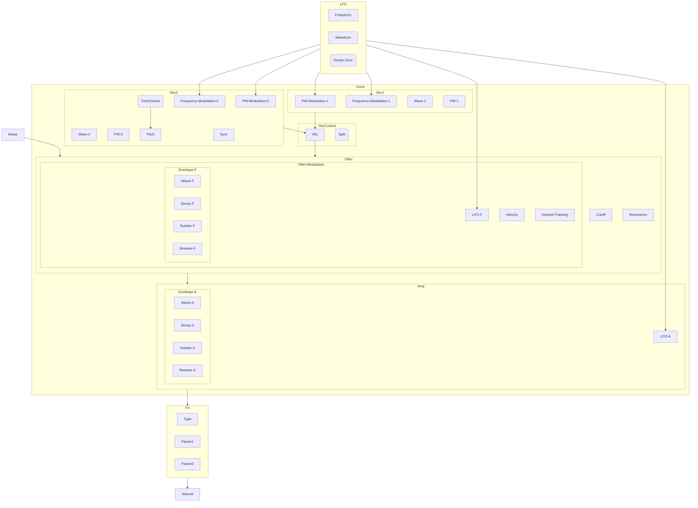

# desktop-synthesizer

A polyphonic, multi-oscillator synth with many bells and many whistles. Based around the Daisy Seed platform.

##Controls
| Control              | Description                 | Unit               |
| --------------------| --------------------------- | ------------------ |
| OSC1WAVEFORM         | Waveform of oscillator 1     | Wavetype                |
| OSC1PULSEWIDTH       | Pulse width of oscillator 1  | %                  |
| OSC1FREQUENCYMOD     | Frequency modulation of oscillator 1 from LFO | %  |
| OSC1PWMOD            | Pulse width modulation of oscillator 1 from LFO| % |
| OSC2WAVEFORM         | Waveform of oscillator 2     | Wavetype                |
| OSC2PULSEWIDTH       | Pulse width of oscillator 2  | %                  |
| OSC2FREQUENCYMOD     | Frequency modulation of oscillator 2 from LFO | % |
| OSC2PWMOD            | Pulse width modulation of oscillator 2 from LFO| % |
| OSC2TUNEFINE         | Fine tune of oscillator 2    | Cents              |
| OSC2TUNECOARSE       | Coarse tune of oscillator 2  | Semitones          |
| OSC2SYNC             | Oscillator 1 resets oscillator 2s cycle | True/False         |
| NOISE                | Level of white noise         | dB                 |
| OSCMIX               | Mix between oscillator 1 and 2 | %               |
| OSCSPLIT             | Split keyboard at C4, left side is Osc1 and right is Osc2 | True/False            |
| FILTERCUTOFF         | Cutoff frequency of filter   | Hz                 |
| FILTERRESONANCE      | Resonance of filter           | %                 |
| FILTERLFOMOD         | Frequency modulation of filter by LFO | Hz      |
| FILTERVELOCITYMOD    | Modulation of filter by velocity | dB            |
| FILTERKEYBEDTRACK    | Tracking of filter by keybed position | dB/octave |
| FILTERATTACK         | Envelope attack of filter     | s                  |
| FILTERDECAY          | Envelope decay of filter      | s                  |
| FILTERSUSTAIN        | Envelope sustain of filter    | %                  |
| FILTERRELEASE        | Envelope release of filter    | s                  |
| AMPATTACK            | Envelope attack of amplifier | s                  |
| AMPDECAY             | Envelope decay of amplifier   | s                  |
| AMPSUSTAIN           | Envelope sustain of amplifier | %                  |
| AMPRELEASE           | Envelope release of amplifier | s                  |
| AMPLFOMOD            | Frequency modulation of amplifier by LFO | Hz |
| LFOWAVEFORM          | Waveform of LFO               | Wavetype                |
| LFOFREQUENCY         | Frequency of LFO              | Hz                 |
| LFOTEMPOSYNC         | Synchronize LFO to tempo      | True/False                |
| FXTYPE               | Type of effect                | N/A                |
| FXPARAM1             | Parameter 1 of effect         | N/A                |
| FXPARAM2             | Parameter 2 of effect         | N/A                |
| FXMIX                | Mix level of effect           | %                  |

##Control-Flow diagram

