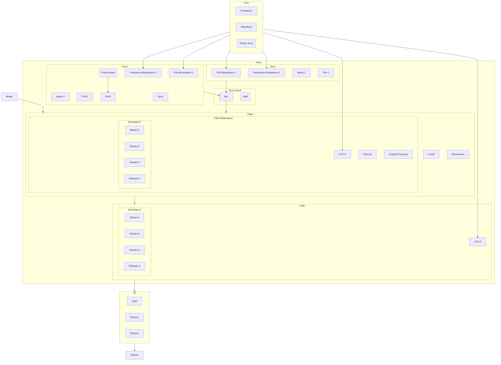

# desktop-synthesizer

A polyphonic, multi-oscillator synth with many bells and many whistles. Based around the Daisy Seed platform.

```mermaid
flowchart TB

    LFO-->PW-Modulation-1
    LFO-->PW-Modulation-2
    LFO-->Frequency-Modulation-1
    LFO-->Frequency-Modulation-2
    LFO-->LFO-F
    LFO-->LFO-A
    
    Osc1-->Mix
    Osc2-->Mix
    
    Moise-->Filter
    Mix-->Filter
    
    Filter-->Amp
    
    Amp-->FX
    
    FX-->Volume
    subgraph Voice
      subgraph Osc1
        Wave-1
        PW-1
        Frequency-Modulation-1
        PW-Modulation-1
      end
      subgraph Osc2
        Wave-2
        PW-2
        Frequency-Modulation-2
        PW-Modulation-2
        Pitch
        pitchsw(Fine/Octave)-->Pitch
        Sync
      end
      subgraph OscControl
        Mix
        split(Split)
      end
      subgraph Filter
        Cutoff
        Resonance
        subgraph Filter-Modulation
          Velocity
          LFO-F
          Keybed-Tracking
          subgraph Envelope-F
            Attack-F
            Decay-F
            Sustain-F
            Release-F
          end
        end
      end
      subgraph Amp
        LFO-A
        subgraph Envelope-A
          Attack-A
          Decay-A
          Sustain-A
          Release-A
        end
      end
    end
    subgraph LFO
      Frequency
      Waveform
      sync(Tempo-Sync)
    end
    subgraph FX
      Type
      Param1
      Param2
      Mix
    end
    
    
```
